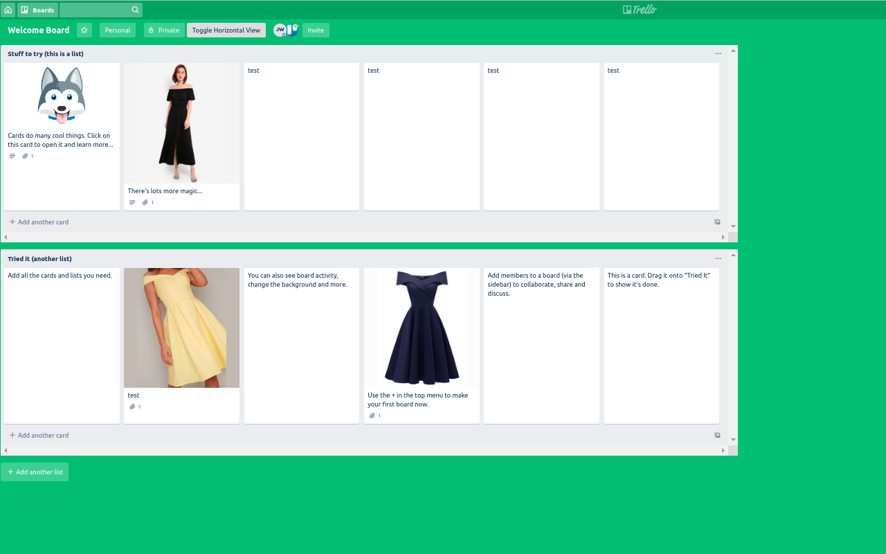

# Trello Horizontal List Extension

As published in the [chrome webstore](https://chrome.google.com/webstore/detail/trello-horizontal-plugin/bnjapjcicacmalbgnpnfgclacakagnli?hl=en&gl=AU).

This plugin converts trello from a vertical list layout to a horizontal list layout.

This is perfect for designers who would like to compare lists visually going across the page rather than down the page.

Any feedback or requests raise an issue or PR. 

Send emails to info@heyshmu.com

---

Shared under CCv4

https://creativecommons.org/licenses/by/4.0/
